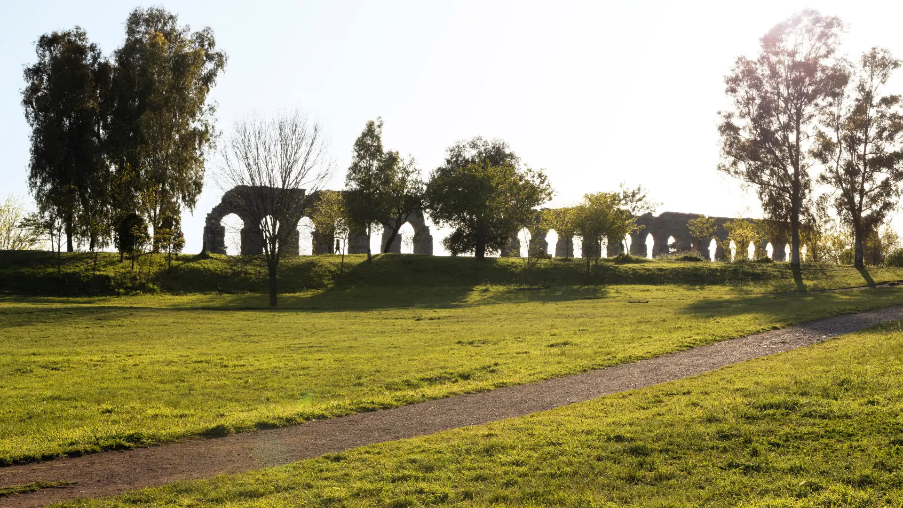
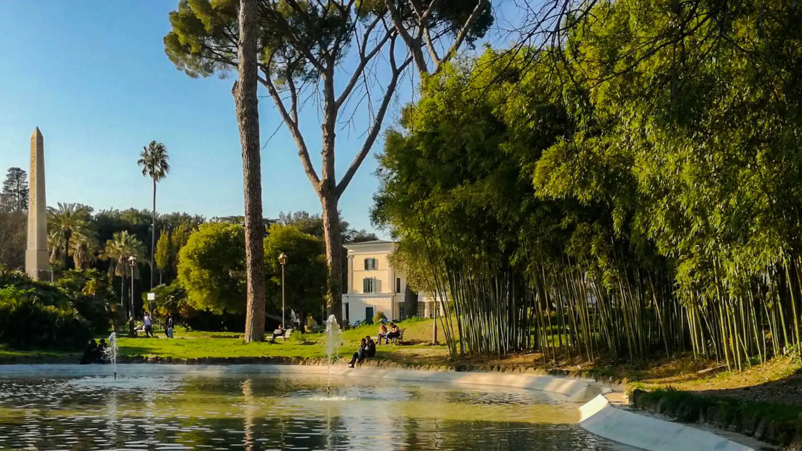
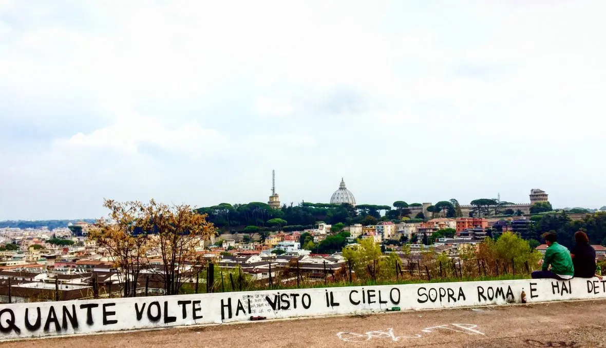
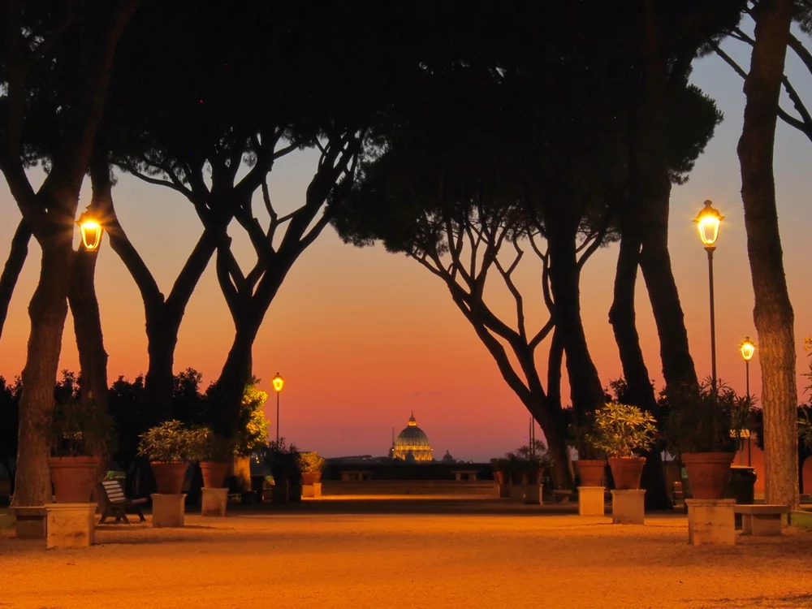
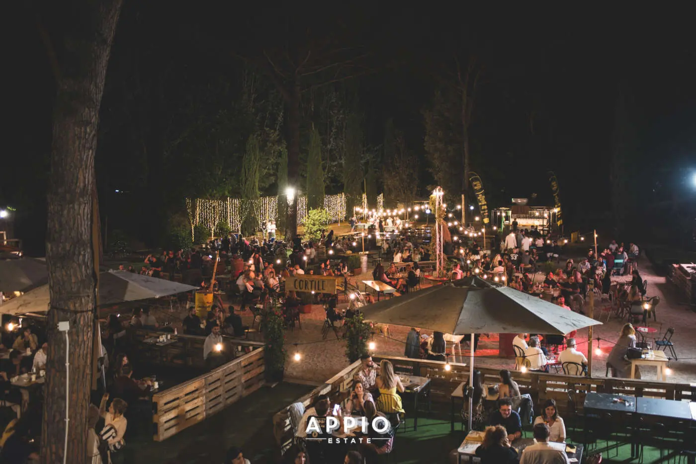

import Callout from "@/components/Callout.astro";
import Slider from "@/components/Slider.astro";

---

## Outdoors & Picnic

### Picnic at Parco degli Acquedotti 🧺

<Callout type="map">
  <a
    href="https://maps.app.goo.gl/217g9U8EMLJa6xzB7"
    target="_blank"
    rel="noopener noreferrer"
  >
    Location: 41.8511106, 12.5574504
  </a>
</Callout>

Scenic and timeless, Parco degli Acquedotti is where ancient Roman aqueducts
cut through open fields — a peaceful escape from the chaos of Rome, perfect for relaxing.

_Foto di turismoroma.it_

### Picnic at Villa Torlonia 🧺

<Callout type="map">
  <a
    href="https://maps.app.goo.gl/s5ifZ97pvbjxRH2s8"
    target="_blank"
    rel="noopener noreferrer"
  >
    Location: 41.9128294,12.5112471
  </a>
</Callout>

Villa Torlonia is a peaceful green oasis in central Rome, offering shaded paths and open lawns perfect for relaxation and picnics.
Located in the tranquil Nomentano district, it provides a serene escape from the city's hustle and bustle.

_Foto di turismoroma.it_

### Relax at Monte Ciocci 😌

<Callout type="map">
  <a
    href="https://maps.app.goo.gl/Hc8N2vkDCQStJcwY8"
    target="_blank"
    rel="noopener noreferrer"
  >
    Location: 41.9051962, 12.4401033
  </a>
</Callout>

A peaceful terrace near the Vatican, Monte Ciocci offers a panoramic view of St. Peter’s Dome.
It’s perfect for a quiet break or enjoying the sunset with a beautiful view of Rome and it's famous writing.

_Foto di parcomonteciocci.wordpress.com_

### Sunset at Giardino degli Aranci 🌅

<Callout type="map">
  <a
    href="https://maps.app.goo.gl/DNY7mYrLg76miTEW6"
    target="_blank"
    rel="noopener noreferrer"
  >
    Location: 41.8849628, 12.4780876
  </a>
</Callout>

Located on the Aventine Hill, this charming garden offers one of Rome’s best sunset views,
with orange trees, a scenic terrace, and a unique optical illusion of St. Peter’s dome.

_Foto di funweek.it_

### Summer festival at Parco Appio 🌻

<Callout type="map">
  <a
    href="https://maps.app.goo.gl/b4DKY9GCkMX3BcMw5"
    target="_blank"
    rel="noopener noreferrer"
  >
    Location: 41.8547331, 12.5267953
  </a>
</Callout>

Parco Appio turns lively in summer with great food and live music.
A great place to chill on a warm evening, singing and drinking with friends under the stars.

_Foto di seafoodsummit.it_

## Food

### Pangocciolo at Matrem Bakery 🍪

<Callout type="map">
  <a
    href="https://maps.app.goo.gl/58xNdW8gPKJwc7bm7"
    target="_blank"
    rel="noopener noreferrer"
  >
    Location: 41.9107012, 12.5181202
  </a>
</Callout>

This cozy bakery is known for its fresh pangoccioli — soft, sweet buns with chocolate chips.
A delicious Roman breakfast or a mid-day snack, even better if eaten at Villa Torlonia.

<Slider qta="2">
  
  
</Slider>

### Roman food at Grazia & Graziella 🍝

<Callout type="map">
  <a
    href="https://maps.app.goo.gl/NJiaRCPyRBj2tds49"
    target="_blank"
    rel="noopener noreferrer"
  >
    Location: 41.8743772, 12.5162089
  </a>
</Callout>

A cozy and authentic Roman restaurant in the heart of the Appio Latino district.
Known for its warm atmosphere and traditional Italian dishes, it's a favorite among locals and visitors alike.

<Slider qta="2">
  
  
</Slider>

### Sushi at Roppongi 🍣

<Callout type="map">
  <a
    href="https://maps.app.goo.gl/VxvLehpzEsJnJCqq5"
    target="_blank"
    rel="noopener noreferrer"
  >
    Location: 41.9012271, 12.4896048
  </a>
</Callout>

Roppongi offers a refined Japanese dining experience with quality sushi and modern decor.
Ideal if you're craving a sushi fix in the heart of Rome

<Slider qta="2">
  
  
</Slider>

### Aperitif at Mood Cafè 🍹

<Callout type="map">
  <a
    href="https://maps.app.goo.gl/9AEMw831aZoFNBip7"
    target="_blank"
    rel="noopener noreferrer"
  >
    Location: 41.912979, 12.5187301
  </a>
</Callout>

Trendy and vibrant, Mood Café is perfect for an evening aperitivo in the heart of Piazza Bologna, a lively student hotspot.
Expect good cocktails, snacks, and a chill atmosphere to start your night out.

<Slider qta="2">
  
  
</Slider>

## Famous places & streets

### Panisperna street ⚛️

<Callout type="map">
  <a
    href="https://maps.app.goo.gl/HiRy8N1VXKia8hjD8"
    target="_blank"
    rel="noopener noreferrer"
  >
    Location: 41.8974651, 12.4905449
  </a>
</Callout>

Panisperna street is a historic cobblestone street in Rome, famous for Enrico Fermi's 1930s physics laboratory.
Visitors can see the commemorative plaque honoring the brilliant "Boys of Via Panisperna" team.

<Slider qta="2">
  
  
</Slider>

### Montecitorio and Chigi Palaces 🇮🇹

<Callout type="map">
  <a
    href="https://maps.app.goo.gl/Uqa6Gi77y3sAPzV68"
    target="_blank"
    rel="noopener noreferrer"
  >
    Location: 41.900757, 12.4790023
  </a>
</Callout>

At the heart of Italian politics, Montecitorio and Chigi Palaces stand as iconic symbols of power — where national
decisions are made and, if you're lucky, you might spot politicians walking between meetings.

<Slider qta="2">
  
  
</Slider>

### Michelangelo Caetani street

<Callout type="map">
  <a
    href="https://maps.app.goo.gl/SeQCHTW5176GX96E7"
    target="_blank"
    rel="noopener noreferrer"
  >
    Location: 41.8941701, 12.4783679
  </a>
</Callout>

Michelangelo Caetani Street holds a somber place in history — the spot where Aldo Moro’s body was found,
now marked by a memorial plaque that preserves the memory of a turning point in Italy’s political past.

<Slider qta="2">
  
  
</Slider>

## Club & Fun

### Sing and dance at MONK 🕺🏽

<Callout type="map">
  <a
    href="https://maps.app.goo.gl/V4AhrkVWWcgzhYGP7"
    target="_blank"
    rel="noopener noreferrer"
  >
    Location: 41.8969464, 12.524027
  </a>
</Callout>

MONK is a dynamic cultural venue with live concerts, DJ sets, and parties.
It’s a favorite among people for its artsy vibes and chill open space.

<Slider qta="2">
  
  
</Slider>

### Karaoke at Scomodo 🎤

<Callout type="map">
  <a
    href="https://maps.app.goo.gl/pxQYvgkHoLRpGbuP7"
    target="_blank"
    rel="noopener noreferrer"
  >
    Location: 41.8904477, 12.508064
  </a>
</Callout>

A fun and casual spot where you can sing your heart out. Scomodo is an unconventional place
full of karaoke energy — perfect for an easygoing night with friends...and more.

<Slider qta="2">
  
  
</Slider>

## District

### EUR distric 🏙️

<Callout type="map">
  <a
    href="https://maps.app.goo.gl/F3b4gtx1JTF53GnP6"
    target="_blank"
    rel="noopener noreferrer"
  >
    Location: 41.8293564, 12.4679553
  </a>
</Callout>

A Rome’s modernist quarter, with Fascist-era architecture and landmarks like the "Colosseo Quadrato".
With ministries, skyscrapers, a sports arena, and a lakeside park, it’s an interesting area to explore beyond the city center.

<Slider qta="2">
  
  
</Slider>

### Coppedè distric 🏡

<Callout type="map">
  <a
    href="https://maps.app.goo.gl/3zrLHCSRmbZJHSrG7"
    target="_blank"
    rel="noopener noreferrer"
  >
    Location: 41.9187992,12.4997605
  </a>
</Callout>

A unique micro-neighborhood blending Art Nouveau, medieval, and fairytale styles.
Small but full of charm — an unusual sight in Rome, perfect for curious tourists and architecture lovers.

<Slider qta="2">
  
  
</Slider>

### Garbatella distric 🏘️

<Callout type="map">
  <a
    href="https://maps.app.goo.gl/WwkLg7GtMRmsiZQr9"
    target="_blank"
    rel="noopener noreferrer"
  >
    Location: 41.862924, 12.485254
  </a>
</Callout>

Authentic and local, Garbatella feels like a small village within Rome.
With historic houses and trattorias, it’s a slice of real Roman life.

<Slider qta="2">
  
  
</Slider>

## Work/Study

### Caffè Letterario 👨🏻‍💻

<Callout type="map">
  <a
    href="https://maps.app.goo.gl/qrt7brNdipWqB4FE6"
    target="_blank"
    rel="noopener noreferrer"
  >
    Location: 41.8710601, 12.4776833
  </a>
</Callout>

A cultural café with bookshelves, art, and plenty of seating. Ideal for studying,
remote work, or just enjoying a quiet espresso in a creative atmosphere.

<Slider qta="2">
  
  
</Slider>

---
